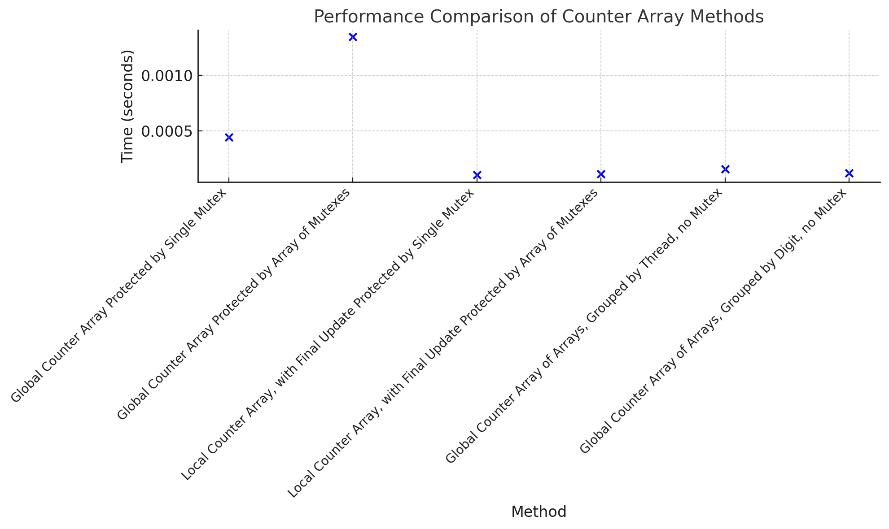
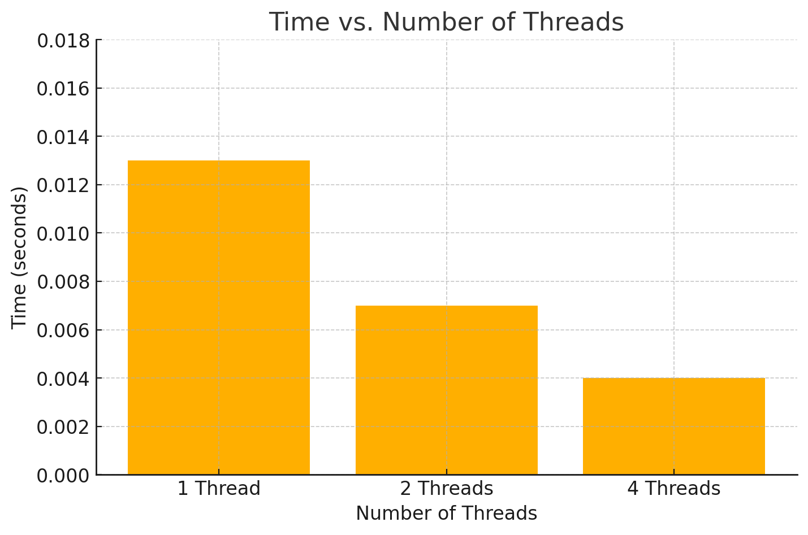
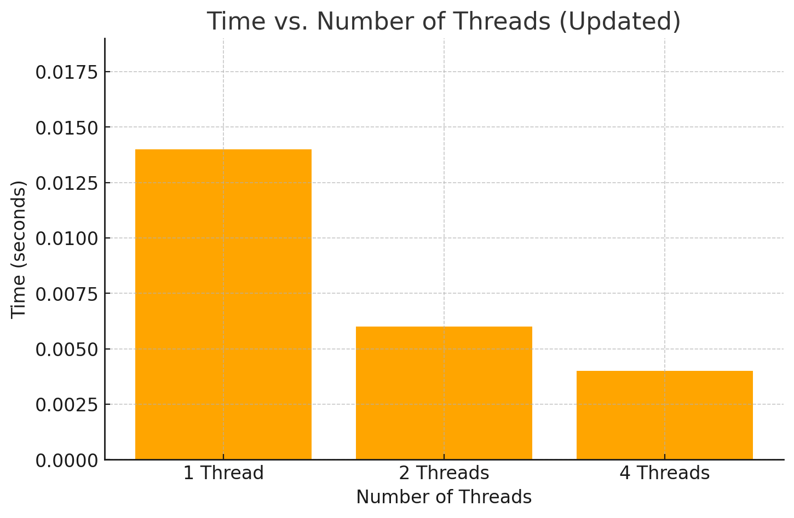
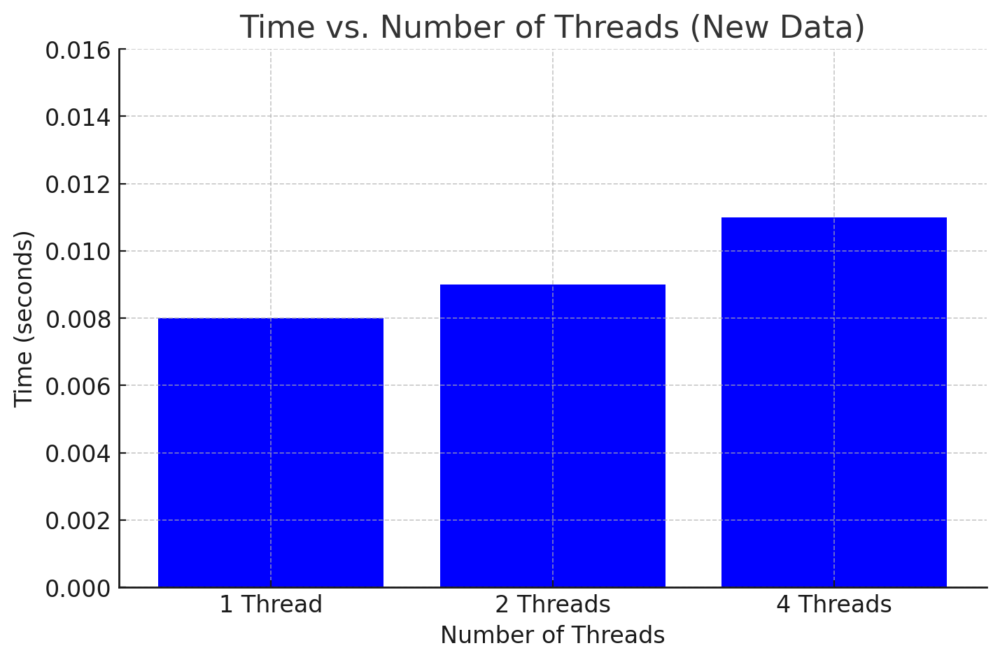

# Project 4
Derek Hessinger (partner: Sumira Naroola)  
Prof. Ying Li  
CS 333  
11/10/24

## Google Sites URL: https://sites.google.com/colby.edu/dereks-cs333-site/home?authuser=1

## Directory Tree
```
.
├── README.md
├── c
│   ├── benford
│   │   ├── benford_par
│   │   ├── benford_par.c
│   │   ├── benford_par_2
│   │   ├── benford_par_2.c
│   │   ├── benford_par_3
│   │   ├── benford_par_3.c
│   │   ├── benford_par_4
│   │   ├── benford_par_4.c
│   │   ├── benford_par_5
│   │   ├── benford_par_5.c
│   │   ├── benford_par_6
│   │   ├── benford_par_6.c
│   │   ├── benford_sequential
│   │   ├── benford_sequential.c
│   │   ├── longer.bin
│   │   ├── longer_nonBenford.bin
│   │   ├── medium.bin
│   │   ├── my_timing.c
│   │   ├── my_timing.h
│   │   └── super_short.bin
│   └── kit
│       ├── IMG_4203.ppm
│       ├── bold_parallel.ppm
│       ├── my_timing.c
│       ├── my_timing.h
│       ├── ppmIO.c
│       ├── ppmIO.h
│       ├── task2
│       ├── task2.c
│       └── updated_img.ppm
├── c++
│   ├── IMG_4203.ppm
│   ├── matrix
│   ├── matrix.cpp
│   ├── poetry
│   ├── poetry.cpp
│   ├── ppmIO.c
│   ├── ppmIO.h
│   ├── ppmIO.o
│   ├── task2
│   ├── task2.c++
│   └── updated_img.ppm
├── media
│   ├── ex1_p1.png
│   ├── p2_task2.png
│   ├── task1.png
│   └── task2.png
└── ocaml
    ├── IMG_4203.ppm
    ├── task2
    ├── task2.cmi
    ├── task2.cmx
    ├── task2.ml
    ├── task2.o
    └── updated_img.ppm
```
## Operating system and C compiler
OS: Apple Sonoma \
C compiler: Apple clang version 15.0.0 (clang-1500.3.9.4), Target: arm64-apple-darwin23.5.0, Thread model: posix

## Part 1

### Task 1
For each of the subtasks within task 1, I created a C different file. I'll give a description of how to run each file below:

### Global Counter Array Protected by Single Mutex
To compile and run the program:  
```
gcc -o benford_par my_timing.c benford_par.c -lm -lpthread
./benford_par
```
There are no known bugs within the program

### Global Counter Array Protected by Array of Mutexes
To compile and run the program:  
```
gcc -o benford_par_2 my_timing.c benford_par_2.c -lm -lpthread
./benford_par_2
```
There are no known bugs within the program

### Local Counter Array, with Final Update Protected by Single Mutex
To compile and run the program:  
```
gcc -o benford_par_3 my_timing.c benford_par_3.c -lm -lpthread
./benford_par_3
```
There are no known bugs within the program

### Local Counter Array, with Final Update Protected by Array of Mutexes
To compile and run the program:  
```
gcc -o benford_par_4 my_timing.c benford_par_4.c -lm -lpthread
./benford_par_4
```
There are no known bugs within the program

### Global Counter Array of Arrays, Grouped by Thread, no Mutex
To compile and run the program:  
```
gcc -o benford_par_5 my_timing.c benford_par_5.c -lm -lpthread
./benford_par_5
```
There are no known bugs within the program

### Global Counter Array of Arrays, Grouped by Digit, no Mutex
To compile and run the program:  
```
gcc -o benford_par_6 my_timing.c benford_par_6.c -lm -lpthread
./benford_par_6
```
There are no known bugs within the program

### Analysis

a. What conclusions can you draw?   
Using a local counter array with the final product protected by a mutex performs the fastest, while using a global array with mutexe(s) performs the slowest. I believe this is due to the time that is added by the mutex locks. The less operations that need to wait on mutexes, the faster a program can perform.   
b. What can you say about the roles of mutex locks for this problem?    
Mutex locks serve to protect shared counters but their impact varies significantly with implementation. Using a single global mutex creates a major bottleneck as threads compete for access, while an array of mutexes reduces this contention by allowing concurrent updates to different digits. Local counters with final synchronization minimize mutex usage, and the no-mutex approaches eliminate synchronization overhead entirely by giving each thread dedicated memory space.
In what conditions would you want to use a mutex?   
Mutex locks are necessary when multiple threads need to safely modify shared data and accuracy of concurrent updates is essential. They should be avoided when threads can operate on independent memory locations or when the performance cost of synchronization outweighs its benefits.

### Task 2
To compile and run the program:  
```
gcc -o task2 -I. task2.c ppmIO.c my_timing.c -lm
./task2 <file name> <num of threads>
```
There are no known bugs within the program

Output of the program:  

As seen in the graph above, as the number of threads increases, so does the speed of the program. I performed 100 iterations each time I ran the program to get a well represented average. The multithreading process allows for the program to efficiently apply pixel operations to an image, as the image can be divided up among threads.

## Part 2

### Task 1
Link to Google Sites page: https://sites.google.com/colby.edu/dereks-cs333-site/home?authuser=1

### Task 2
To compile and run the program:  
```
g++ -o task2 task2.c++ ppmIO.o -pthread -std=c++17
./task2 <file name> <num of threads>
```
There are no known bugs within the program

Output of the program:


Similar to C, as the number of threads increases, so does the speed of the program. As in task 1, I performed 100 iterations each time I ran the program to get a well represented average. I believe the similar numbers are due to C++ being built on top of C, therefore the same trend of multithreading allowing for the program to more efficiently apply pixel operations to an image is present.

## Extensions

For our extensions, we did part 2 for OCaml and 2 minor extensions: a matrix and poem in C++   

### Extension 1
Part 1 of task 2 for OCaml can be found on the Google Site: https://sites.google.com/colby.edu/dereks-cs333-site/home?authuser=1

### Extension 2
To compile and run the program:
```
ocamlopt -o task2 task2.ml
./task2 <file name> <num of threads>
```
There are no known bugs within the program    

Output of the program:


As seen in the screenshot above, OCaml has an interesting phenonmenon where as the amount of threads increases, the speed of the execution slows down. I'm not entirely sure why this is, but it may be due to our implementation. OCaml offers several libraries for thread implementation, and we may not be utilizing the correct library. This differs from C++ and C where the more amount of threads generally correlates with a faster execution of the program time.

### Extension 3
For our third extension, we implemented a matrix in C++.

### Extension 4
For our fourth extension, we implemented a poem in C++.
